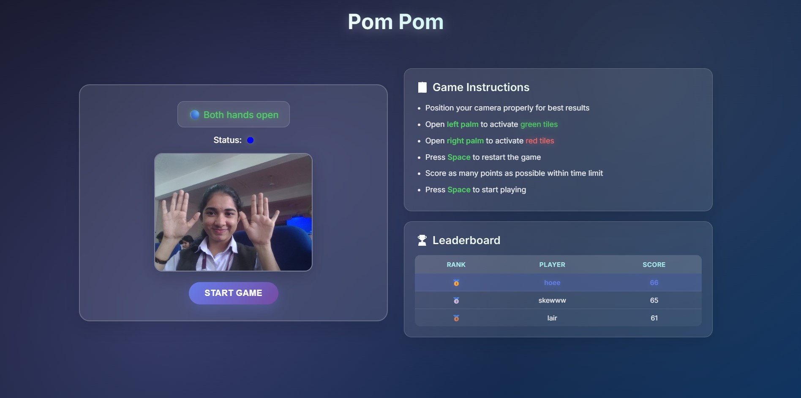
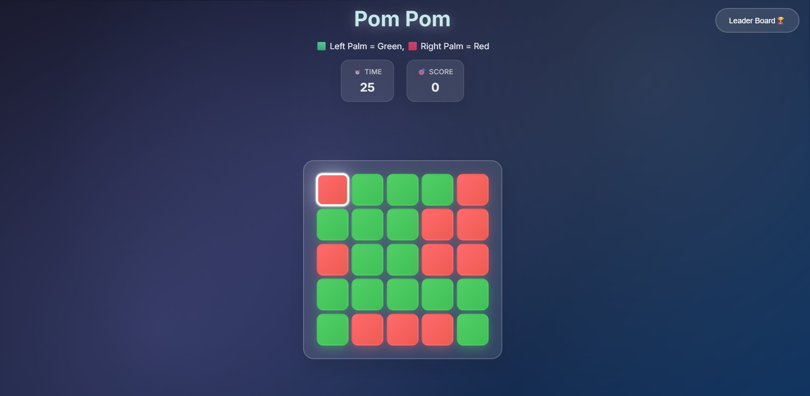
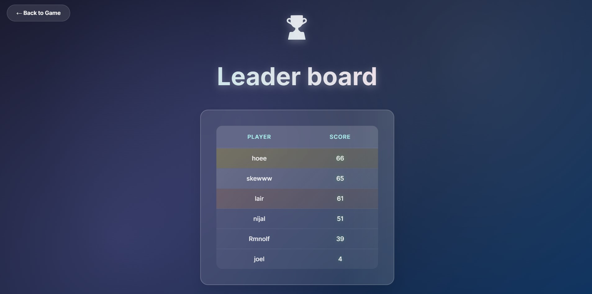

# [Pom Pom] 🎯

## Basic Details

### Team Name: [Liars]

### Team Members

- Team Lead: [Vishnu P P] - [AISAT]
- Member 2: [Joel prince] - [AISAT]

### Project Description

[Pom Pom is a gesture-controlled game where players use hand movements detected via webcam.]

### The Problem (that doesn't exist)

[Urgent need to Pom Pom everyday]

### The Solution (that nobody asked for)

[Turn your hands into pom-pom cannons. No buttons. Just vibes]

## Technical Details

### Technologies/Components Used

For Software:

    Frontend:HTML, CSS, JS
    Backend :Firebase Services, Firebase Auth, Firestore(db)
    Libraries:Firebase SDK, MediaPipe Hands, Google Fonts
    Hosting: Vercel

### Implementation

For Software:

# Installation

Access the website at https://pom-pom-pom.vercel.app/

# Run

[commands]

### Project Documentation

For Software:

# Screenshots (Add at least 3)

Initial Home screen where players learn how the game controls work.

Game screen where the fun stuff happens.

Leaderboard to find who the POM POM god is.

# Diagrams

_Add caption explaining your workflow_

For Hardware:

# Schematic & Circuit

_Add caption explaining connections_

_Add caption explaining the schematic_

# Build Photos

_List out all components shown_

_Explain the build steps_

_Explain the final build_

### Project Demo

# Video

[Add your demo video link here]
_Explain what the video demonstrates_

# Additional Demos

[Add any extra demo materials/links]

## Team Contributions

- [Vishnu P P]: [Gameplay and backend]
- [Joel prince]: [Front end]

---

Made with ❤️ at TinkerHub Useless Projects

